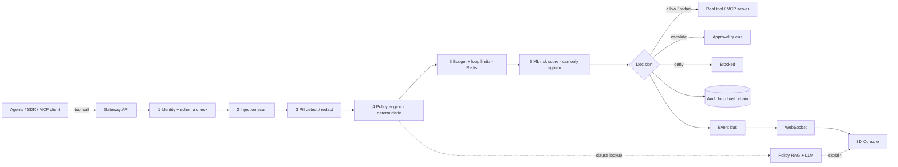

# 03 — Architecture

## Principle
**Deterministic policy decides. AI advises and explains.** The allow/deny/redact/escalate outcome comes only from the policy engine plus hard limits. ML scores, injection flags and RAG output are inputs (can only make a decision *stricter*) or explanations, never sole authority.

## System diagram


## Decision pipeline (order matters)
1. Authenticate agent (API key -> agent_id); reject unknown.
2. Validate request against tool JSON schema; reject malformed.
3. Injection scan on inbound tool *outputs/context* attached to the call.
4. PII detect; tag data classes; redact if policy says so.
5. Policy evaluation: explicit deny > escalate > allow > default deny. Record matching rule id + policy version.
6. Budget/loop check (tokens, spend, calls per window, repeated-call signature).
7. Risk score (async for non-blocking; sync only if cheap). Score above threshold upgrades allow -> escalate, never downgrades a deny.
8. Emit decision, append audit record, publish event.
Latency budget: steps 1-6 p95 < 50 ms.

## Components
| Component | Tech | Notes |
|---|---|---|
| Web | Vite, React, TypeScript, react-three-fiber, drei, postprocessing, Zustand, Tailwind, Framer Motion, TanStack Query | 3D + 2D fallback |
| API | FastAPI, Pydantic v2, SQLAlchemy 2, Alembic, uvicorn | REST + WebSocket |
| Policy engine | Python evaluator over YAML DSL (MVP); Cedar via cedarpy as P2 | Versioned, hot reload |
| DB | PostgreSQL 16 + pgvector | Single DB for MVP (relational + vectors) |
| Cache/limits | Redis | Counters, loop signatures, pub/sub |
| RAG | pgvector, hybrid (BM25 via Postgres FTS + vectors), local embeddings (bge-small or similar), optional reranker | Provider-neutral LLM client |
| ML | scikit-learn Isolation Forest (risk); heuristics + small classifier (injection) | Models in `services/api/app/ml` |
| Graph (P2) | Neo4j or Postgres recursive queries | Agent-tool-policy graph |
| Simulator | Python, seeded RNG | Emits real gateway calls |
| SDK | Python package with `@guard` decorator + MCP proxy | |
| Infra | Docker Compose; GitHub Actions CI | |

## Repo layout
```
apps/web/src/{scenes,components,stores,api,hooks,styles}
services/api/app/{gateway,policy,pii,injection,risk,rag,audit,approvals,replay,redteam,dpdp,ws,models,schemas,core}
services/api/tests
services/simulator/{agents,attacks}
packages/sdk-python/prahari_sdk
policies/examples   # yaml + sample policy PDFs/markdown for RAG
docs/
docker-compose.yml
```

## Security requirements
- Agent API keys hashed at rest; secrets only via env; `.env.example` committed, `.env` ignored.
- Audit log append-only; each record stores `prev_hash` and `hash = SHA256(prev_hash || canonical_json)`; `/audit/verify` recomputes chain.
- RAG/LLM output is escaped in UI (no HTML injection). Treat retrieved policy text as data, not instructions.
- Rate-limit the gateway; CORS locked to configured origins.
- RBAC roles: admin, analyst, approver, viewer (P2 enforce; MVP single admin).
- Fail-closed: if policy engine errors, decision = deny with reason `engine_error`.

## Observability
Structured JSON logs, OpenTelemetry traces on the pipeline steps, `/metrics` (Prometheus format).
